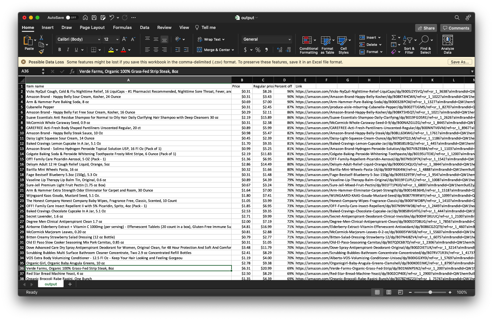

# Amazon Fresh Script
Amazon uses a dynamic pricing algorithm to discount products that aren't selling well. This script uses Node.js and Puppeteer to scrape the Amazon Fresh website and find deeply discounted products (>35% off). The output is a .csv file containing the item name & link as well as the price and percent off. 

## Screenshots

## Installation
Make sure you have a recent version of Node.js installed on your computer. After cloning this repository, install the required libraries by running `npm install` Open the _constants.json_ file and change the zip code field to the city in which you wish to run the script. If you would like to hide the browser while the script is running, change the _useHeadlessMode_ parameter to `true`.
Run the script using the command `node index` and monitor the terminal for status updates. After completion, an _output.csv_ file will be created in the project directory which can be opened using any spreadsheet viewer. 